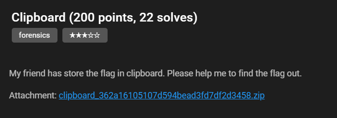

# Clipboard
## Challenge Details


## Solution
The zip file contains a `Windows 7 x64.mem` file. I guessed this file is the memory dump of a Windows 7 machine. As the title and description of the challenge implies that the secret is inside the clipboard of the machine, we need to peek into the data of clipboard using `Volatility`.

The file name implies that it is a Windows 7 x64 machine. Thus, I used the `Win7SP1x64` profile:
```bash
python2 vol.py -f Windows\ 7\ x64.mem --profile=Win7SP1x64 clipboard -v
```
The output is the following:
```
<SNIP>
         1 ------------- ------------------            0x7010d 0xfffff900c3600000                                                   
0xfffff900c3600014  7b 5c 72 74 66 31 5c 61 6e 73 69 5c 61 6e 73 69   {\rtf1\ansi\ansi
0xfffff900c3600024  63 70 67 31 32 35 32 5c 64 65 66 66 30 5c 64 65   cpg1252\deff0\de
0xfffff900c3600034  66 6c 61 6e 67 31 30 33 33 7b 5c 66 6f 6e 74 74   flang1033{\fontt
0xfffff900c3600044  62 6c 7b 5c 66 30 5c 66 6e 69 6c 5c 66 63 68 61   bl{\f0\fnil\fcha
0xfffff900c3600054  72 73 65 74 30 20 43 61 6c 69 62 72 69 3b 7d 7d   rset0.Calibri;}}
0xfffff900c3600064  0d 0a 7b 5c 2a 5c 67 65 6e 65 72 61 74 6f 72 20   ..{\*\generator.
0xfffff900c3600074  4d 73 66 74 65 64 69 74 20 35 2e 34 31 2e 32 31   Msftedit.5.41.21
0xfffff900c3600084  2e 32 35 31 30 3b 7d 5c 76 69 65 77 6b 69 6e 64   .2510;}\viewkind
0xfffff900c3600094  34 5c 75 63 31 5c 70 61 72 64 5c 73 61 32 30 30   4\uc1\pard\sa200
0xfffff900c36000a4  5c 73 6c 32 34 30 5c 73 6c 6d 75 6c 74 31 5c 6c   \sl240\slmult1\l
0xfffff900c36000b4  61 6e 67 39 5c 66 30 5c 66 73 32 32 7b 5c 70 69   ang9\f0\fs22{\pi
0xfffff900c36000c4  63 74 5c 77 6d 65 74 61 66 69 6c 65 38 5c 70 69   ct\wmetafile8\pi
0xfffff900c36000d4  63 77 31 30 35 38 33 5c 70 69 63 68 31 30 35 38   cw10583\pich1058
0xfffff900c36000e4  33 5c 70 69 63 77 67 6f 61 6c 36 30 30 30 5c 70   3\picwgoal6000\p
0xfffff900c36000f4  69 63 68 67 6f 61 6c 36 30 30 30 20 0d 0a 30 31   ichgoal6000...01
0xfffff900c3600104  30 30 30 39 30 30 30 30 30 33 32 32 62 39 30 35   000900000322b905
0xfffff900c3600114  30 30 30 30 30 30 66 39 62 38 30 35 30 30 30 30   000000f9b8050000
0xfffff900c3600124  30 30 30 34 30 30 30 30 30 30 30 33 30 31 30 38   0004000000030108
0xfffff900c3600134  30 30 30 35 30 30 30 30 30 30 30 62 30 32 30 30   00050000000b0200
0xfffff900c3600144  30 30 30 30 30 30 30 35 30 30 30 30 0d 0a 30 30   000000050000..00
0xfffff900c3600154  30 63 30 32 66 34 30 31 66 34 30 31 30 33 30 30   0c02f401f4010300
0xfffff900c3600164  30 30 30 30 31 65 30 30 30 34 30 30 30 30 30 30   00001e0004000000
0xfffff900c3600174  30 37 30 31 30 34 30 30 30 34 30 30 30 30 30 30   0701040004000000
<SNIP>
```

The starting part of this memory shows that it is an RTF file. Therefore, we need to find a way to dump this file. I used a python script to write the bytes to a file.
```python
file_string = ""

with open('result_copy', 'r') as f:
    lines = f.readlines()
    count = 1
    for line in lines:
        s = ''
        line = line[19:67]
        for i in range(16):
            try:
                s += chr(int(line[i * 3 : (i + 1) * 3], 16))
            except ValueError:
                pass
        file_string += s
        count += 1
print(file_string)
with open('result.rtf', 'w') as f:
    f.write(file_string)
```

Now open this file in Microsoft Word. The file contains an image with flag. Goal!


## Flag
```
hkcert22{f0r3ns1c_1s_fun_t0_p14y_w1th}
```